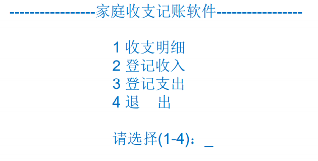
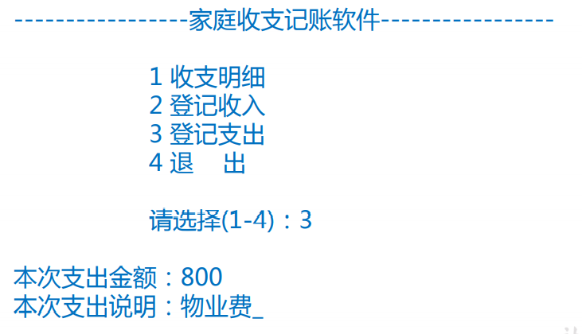
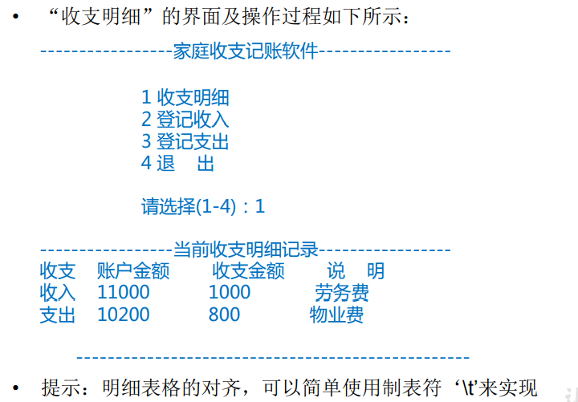
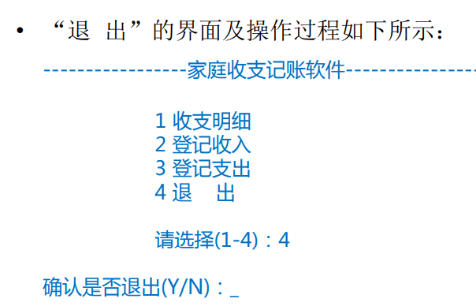
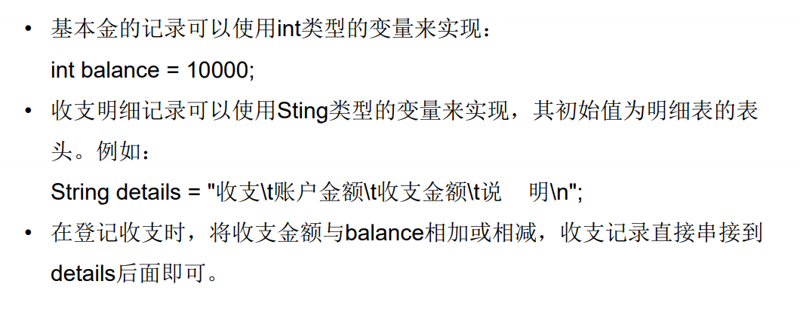
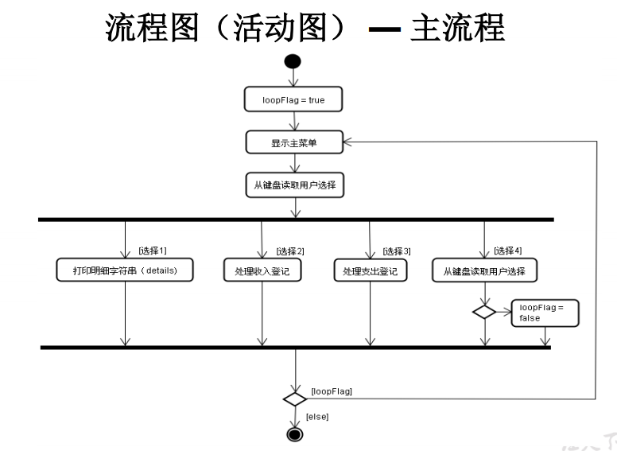
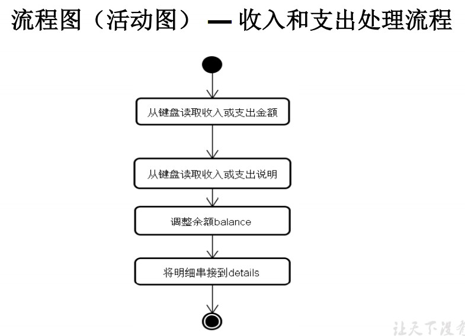
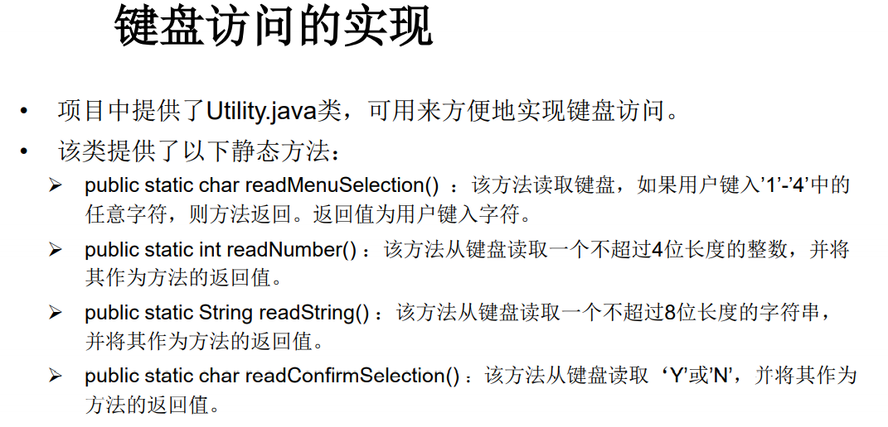
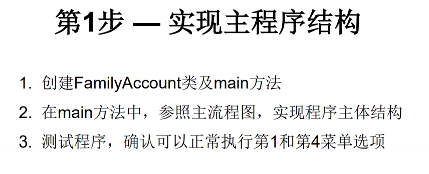
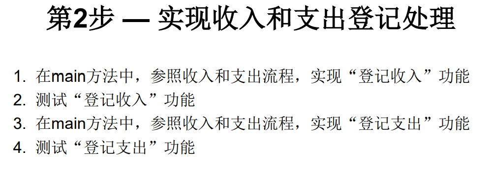

<<<<<<< HEAD
模拟实现基于文本界面的家庭记账软件。

能够记录家庭的收入、支出，并且能够打印收支明细。

项目采用分级菜单方式。

 

家庭起始的生活基本金：10000元

选2登记收入后，收入金额累计到本金，并记录收入明细

 

选3登记指出后，支出金额从本金中扣除，并记录支出明细

 

选1查询收支明细时，显示所有的收入、支出明细列表

 

 

 

流程图

 

 

 

 

 
=======
>>>>>>> fd74dc132ab484d1de75386b91806aab24d4b568
